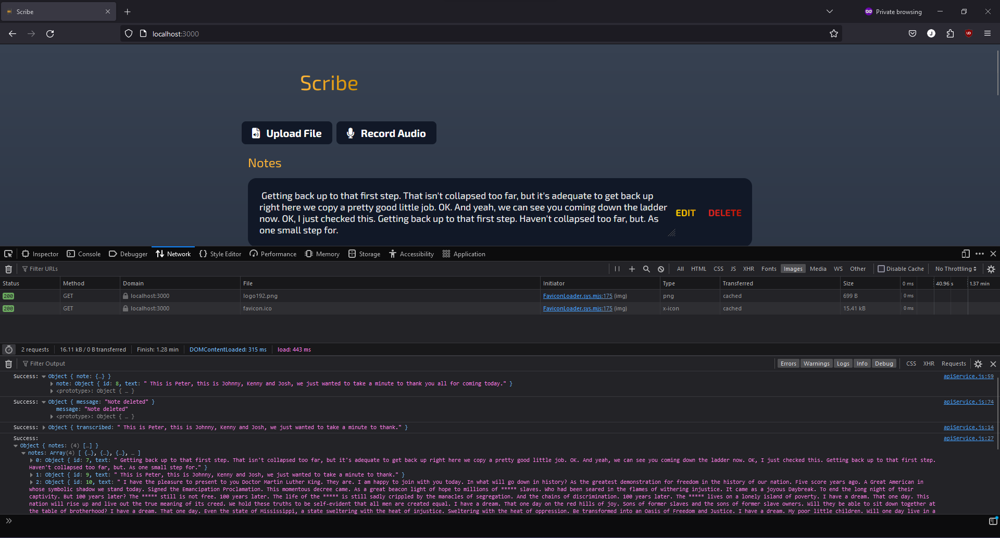

# Scribe

Scribe is a web app that records audio transcriptions into notes. The goal of this app, should it become a final project, is to implement an LLM to generate organized and easy-to-read notes from a long audio recording.

The Scribe frontend implements audio recording, a clean UI, and API integration with the backend. The UI is built with React, and audio recording is done with the [react-media-recorder-2](https://www.npmjs.com/package/react-media-recorder-2). JavaScript's fetch API is used to communicate with the backend.

The Scribe backend handles audio transcription, analysis, and user data storage. Audio transcription is done using the [Azure Speech to Text](https://learn.microsoft.com/en-us/azure/ai-services/speech-service/speech-to-text) service. User storage will be done with MongoDB, and communication to the frontend will be done with [FastAPI](https://fastapi.tiangolo.com/). Research still needs to be done on which LLM to use for synthesizing notes. It will need to have a free tier for API calls to it, and be good at understanding and writing text.

### Credits

* The template UI code is repurposed from [this](https://www.youtube.com/watch?v=MkESyVB4oUw) task list tutorial by Tyler Potts. It has been updated to work in React. 
* The project is also based on instructor Changhui Xu's [to-do app example](https://github.com/changhuixu/CS3980-2024/tree/main/my_todo_app), particularly on the backend. 
* ChatGPT and Github CoPilot were used to help learn the tools used in this project, generate code fragments, and debug. 
* The Favicon is the Notebook Flat Icon Vector from [Wikimedia Commons](https://commons.wikimedia.org/wiki/File:Notebook_Flat_Icon_Vector.svg) by Videoplasty.com, CC-BY-SA 4.0.

# Demos

CRUD actions:
    <div style="position: relative; padding-bottom: 56.25%; height: 0;"><iframe src="https://www.loom.com/embed/1466ae1d1391430f85811b4509db6963?sid=2d92dc7d-2565-473f-86ab-683af466f3fc" frameborder="0" webkitallowfullscreen mozallowfullscreen allowfullscreen style="position: absolute; top: 0; left: 0; width: 100%; height: 100%;"></iframe></div>

Multiple notes:
    

Network log in frontend:
    

HTTP log in backend:
    

## Development Notes

### Project Design

The backend is a FastAPI app coordinated by `main.py`. main initiates the app, coordinates the router, and holds the transcription endpoints. The endpoints for managing notes are located in `note.py` to avoid cluttering main, but the states and router for notes are imported into main. 

All models are stored in `model.py`, currently that is just the model for notes.

`transcriber.py` contains the script for communicating with Azure's speech-to-text API. The method transcribe takes a wav file in and returns the transcription of the file. As a by-product it will save the wav file to the Uploads directory, this may be removed in future versions.

[frontend design here]

### Requirements

* Node v20.11.0+ [LTS](https://nodejs.org/en/)
* Python 3.12.x

## Project Setup

The below instructions are for quick setup. I have written scripts that install all dependencies and set up environments, as well as create an alias to run the project with one command. If they fail you, the instructions for setting up manually are in the project setup sections of each submodule's readme. Be very mindful of which folders you are running commands in.

**IMPORTANT**: I have not tested the scripts for Mac/Linux. It is likely these will fail and you will need to manually configure the project. I am sorry, please reach out if you need help.

### Quick Setup

1. Give the scripts permission to run:
    * Windows:
        1. Run ```Set-ExecutionPolicy AllSigned``` in a powershell window as an administrator.
            * If that fails try ```Set-ExecutionPolicy RemoteSigned -Scope CurrentUser -Force```
    * Mac/Linux:
        1. Run ```chmod +x mac-setup.sh config.sh start.sh``` in the Scribe folder
        2. Run ```chmod +x be-mac-setup.sh``` in the ScribeBE/setup folder
        3. Run ```chmod +x fe-mac-setup.sh``` in the ScribeFE/setup folder
2. Insert the API Key for Microsoft Azure STT:
    1. Open the config file for your OS (```.config.ps1``` for Windows, ```.config.sh``` for Mac).
    2. Replace the your-key value with the API key I have sent to you.
3. Run the setup script:
    1. From the Scribe folder, run the startup script respective to your OS, for example: run ```./windows-setup.ps1``` in VSCode's terminal.
4. Restart your CLI.
5. Run the project:
    * Windows:
        1. Run ./start.ps1 from the Scribe folder
    * Mac/Linux:
        * Run startapp from the Scribe folder
        * Or run ./start.sh from the Scribe folder


If you want to customize the command to start the app, follow these instructions:

Windows:
1. Run ```doskey shortcut-name=.\start.ps1``` every time you open the app and change shortcut-name

Mac/Linux:
1. Run ```nano ~/.bashrc``` (or ```nano ~/.bash_profile``` if that fails)
2. Find the alias startapp
3. Change startapp to whatever you want
